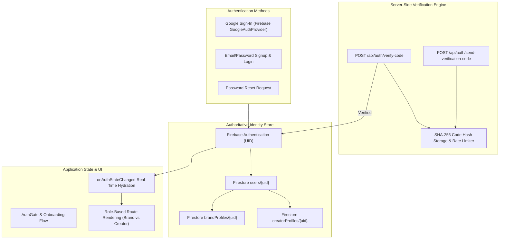

# GenCraft — Authentication & Role-Based Signup Audit

## 1. Audit Overview
This audit examines the current state of authentication, session persistence, user role management, email verification, and database integration within the GenCraft application repository (`c:\tempp\projects\CreatorMatch-AI`).

---

## 2. Existing Repository Architecture & State

### A. Authentication & UI Components
- **`src/components/AuthGate.tsx`**:
  - Acts as the primary entry point when a user is not authenticated.
  - Currently contains client-side role toggling (`brand` vs `creator`) and form inputs for candidate name, email, company/specialization, gender, and AI tools.
  - **Identified Gap**: Uses a mock `Math.floor(100000 + Math.random() * 900000)` client-side OTP generator. The OTP code is stored in local component state and displayed directly in a UI alert/notice banner. No server verification or email delivery occurs.
  - **Identified Gap**: Lacks a "Continue with Google" button, password fields, password confirmation, password strength validation, and Forgot Password recovery flow.
- **`src/components/AuthModal.tsx`**:
  - Modal component accessible from the navigation bar for switching accounts or logging in.
  - Contains basic tab controls for signup vs login, but lacks integration with Firebase Authentication SDKs or Google Sign-In providers.
- **`src/app/page.tsx`**:
  - Manages session state via `localStorage` keys (`gencraft_is_authenticated`, `gencraft_current_user`).
  - Lacks real-time session subscription via Firebase `onAuthStateChanged`.

### B. Firebase & Database Architecture
- **`src/lib/firebase.ts`**:
  - Initializes Firebase Client SDK (`initializeApp`, `getAuth`, `getFirestore`, `getStorage`).
  - Reads configuration from environment variables (`NEXT_PUBLIC_FIREBASE_API_KEY`, `NEXT_PUBLIC_FIREBASE_PROJECT_ID`, etc.).
  - Exports initialized `app`, `auth`, `db`, and `storage` instances.
  - **Identified Gap**: Missing Google Auth Provider helper instance (`GoogleAuthProvider`) and auth action wrappers (`signInWithPopup`, `createUserWithEmailAndPassword`, `signInWithEmailAndPassword`, `sendPasswordResetEmail`, `signOut`).
- **`firestore.rules`**:
  - Defines rules for `users/{userId}`, `creators/{creatorId}`, `portfolios/{portfolioId}`, `briefs/{briefId}`, `matches/{matchId}`, and `engagements/{engagementId}`.
  - Clean structure enforcing `isOwner(userId)` for `users/{userId}`.
- **`src/lib/mongodb.ts` & `src/lib/models/`**:
  - MongoDB Mongoose schemas exist for `Brief`, `Creator`, `Engagement`, `MatchResult`.
  - Firebase UID will serve as the single primary authoritative user identity across Firestore and application state.

### C. Email Verification System
- Currently, no backend routes exist under `src/app/api/auth/`.
- Needs secure server-side routes: `/api/auth/send-verification-code` and `/api/auth/verify-code`.

---

## 3. Identified Gaps & Deficiencies Summary

| Feature / Area | Current State | Required Upgrade |
| :--- | :--- | :--- |
| **Google Sign-In** | Missing | Add Firebase `GoogleAuthProvider` popup/redirect sign-in flow with automatic profile detection and role selection for new users. |
| **Email/Password Auth** | UI-only mock | Implement real Firebase Auth `createUserWithEmailAndPassword` and `signInWithEmailAndPassword` with password validation. |
| **Email Verification** | `Math.random()` in browser | Build trusted server-side OTP delivery & verification via `/api/auth/send-verification-code` with SHA-256 hashing, rate limiting, and 10-minute expiry. |
| **Role Profiles** | Transient local object | Persist authoritative profiles in Firestore under `users/{uid}`, `brandProfiles/{uid}`, and `creatorProfiles/{uid}`. |
| **Password Reset** | Missing | Add "Forgot Password?" flow using Firebase `sendPasswordResetEmail`. |
| **Session Hydration** | LocalStorage only | Subscribe to Firebase `onAuthStateChanged` to restore sessions and user profiles seamlessly. |

---

## 4. Architectural Implementation Plan

---

## 5. Execution Strategy

1. **Auth Core Helper (`src/lib/auth.ts`)**: Build wrapper functions for Firebase Authentication (Google popup, email/password signup/login, password reset, signout, and profile persistence).
2. **Server-Side Verification API (`src/app/api/auth/`)**: Create `/send-verification-code` and `/verify-code` endpoints enforcing SHA-256 hashing, 10-minute expiration, max 5 attempts, and 60-second resend cooldowns.
3. **Upgraded UI Components (`AuthGate.tsx`, `AuthModal.tsx`)**: Implement Google sign-in button, password fields, password confirmation, role selection cards, role-specific onboarding forms, and real email verification.
4. **Session Hydration (`src/app/page.tsx`)**: Wire Firebase `onAuthStateChanged` for real-time auth state synchronization and profile loading.
5. **Documentation & Verification**: Create setup guide (`docs/AUTHENTICATION_SETUP.md`), run automated auth test suite, perform production build, and document test results (`docs/AUTHENTICATION_TEST_REPORT.md`).
