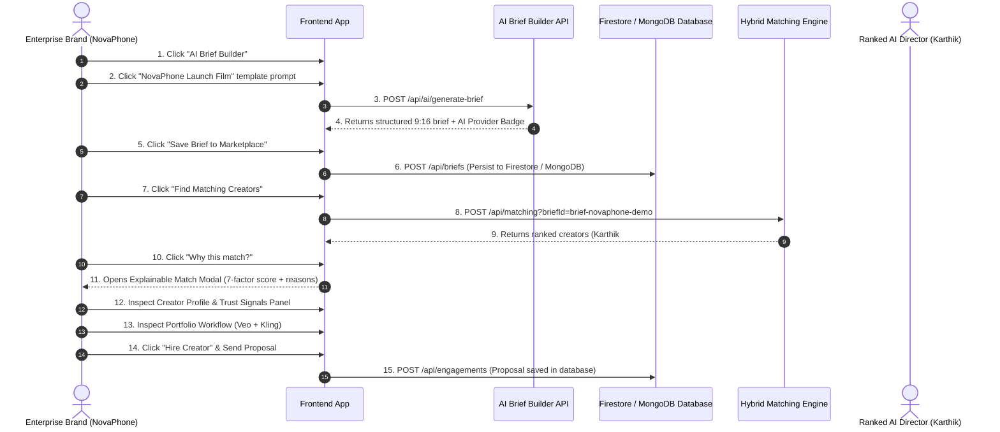

# CreateAI — Hackathon Execution & Deployment Guide

This guide provides end-to-end instructions for installing, configuring, seeding, running, testing, and demonstrating the **CreateAI** platform for the **AI Content Creator Marketplace Hackathon**.

---

## 📋 Table of Contents

1. [Prerequisites & System Requirements](#1-prerequisites--system-requirements)
2. [Firebase Setup & Security Rules](#2-firebase-setup--security-rules)
3. [Environment Configuration](#3-environment-configuration)
4. [Installation & Setup](#4-installation--setup)
5. [Database Seeding](#5-database-seeding)
6. [Running in Development Mode](#6-running-in-development-mode)
7. [Building & Running in Production](#7-building--running-in-production)
8. [Verification & Type Checking](#8-verification--type-checking)
9. [End-to-End Demo Trajectory (NovaPhone Scenario)](#9-end-to-end-demo-trajectory-novaphone-scenario)
10. [API Testing with cURL / Postman](#10-api-testing-with-curl--postman)
11. [Troubleshooting & Common Issues](#11-troubleshooting--common-issues)

---

## 1. Prerequisites & System Requirements

Ensure your environment meets the following specifications:

- **Operating System**: Windows 10/11, macOS, or Linux
- **Node.js**: `v18.17.0` or higher (Recommended: Node 20 LTS)
- **Package Manager**: `npm` v9+ (or `pnpm` / `yarn`)
- **Backend Services**:
  - **Firebase**: Firebase Authentication, Cloud Firestore, Firebase Storage (`src/lib/firebase.ts`)
  - **MongoDB (Fallback / Alternative)**: Local MongoDB (`mongodb://127.0.0.1:27017`) or Cloud MongoDB Atlas
  - *(Note: If backend services are unconfigured during evaluation, the app falls back gracefully to in-memory runtime objects).*

---

## 2. Firebase Setup & Security Rules

### Step 1: Create a Firebase Project
1. Go to the [Firebase Console](https://console.firebase.google.com/).
2. Click **"Add Project"** and name it `createai-marketplace`.
3. Disable Google Analytics (optional for hackathon MVP) and click **Create Project**.

### Step 2: Enable Firebase Services (100% Free Spark Plan - No Credit Card Required)
1. **Authentication**: Navigate to **Build → Authentication** → Click **Get Started** → Enable **Email/Password**. *(100% Free)*
2. **Cloud Firestore**: Navigate to **Build → Firestore Database** → Click **Create Database** → Select **Start in Production Mode**. *(100% Free)*
3. **Media Storage (Zero-Billing Strategy)**: 
   - **No Blaze Plan / Credit Card Needed**: Firebase Storage sometimes asks for a Blaze billing upgrade in certain regions. You can **SKIP Firebase Storage entirely** and stay on the 100% FREE Firebase Spark Plan!
   - Media URLs (images, videos, thumbnails, audio showcases) are stored as direct HTTPS CDN URLs (e.g. Unsplash, Imgur, Cloudinary Free Tier, or DiceBear) directly inside Firestore document fields (`mediaUrl`, `thumbnail`, `avatar`).

### Step 3: Deploy Security Rules
The repository includes production security rules in [`firestore.rules`](file:///c:/tempp/projects/CreatorMatch-AI/firestore.rules) and [`storage.rules`](file:///c:/tempp/projects/CreatorMatch-AI/storage.rules). You can deploy them using **Option A (Web Console - Fastest)** or **Option B (Firebase CLI)**:

#### Option A: Deploy via Firebase Web Console (Recommended for Quick Demo Setup)
1. **Firestore Database Rules**:
   - Copy all contents from [`firestore.rules`](file:///c:/tempp/projects/CreatorMatch-AI/firestore.rules).
   - Go to [Firebase Console](https://console.firebase.google.com/) → Open project `createai-marketplace`.
   - Click **Firestore Database** in sidebar → Click **Rules** tab.
   - Replace the default text with the contents of [`firestore.rules`](file:///c:/tempp/projects/CreatorMatch-AI/firestore.rules) → Click **Publish**.

2. **Storage Rules (Optional - Only if Firebase Storage is enabled)**:
   - Copy all contents from [`storage.rules`](file:///c:/tempp/projects/CreatorMatch-AI/storage.rules).
   - Go to [Firebase Console](https://console.firebase.google.com/) → Open project `createai-marketplace`.
   - Click **Storage** in sidebar → Click **Rules** tab.
   - Replace default text with the contents of [`storage.rules`](file:///c:/tempp/projects/CreatorMatch-AI/storage.rules) → Click **Publish**.

#### Option B: Deploy via Firebase CLI (Automated Deployment)
```bash
# 1. Login to Firebase CLI
npx firebase login

# 2. Link your local project to your Firebase project ID
npx firebase use --add

# 3. Deploy Firestore & Storage rules using configured firebase.json
npx firebase deploy --only firestore:rules,storage
```

---

## 3. Environment Configuration

1. Create a `.env.local` file in the project root:

```bash
cp .env.example .env.local
```

2. Configure environment variables inside `.env.local`:

```env
# ==============================================================================
# FIREBASE BACKEND CONFIGURATION
# ==============================================================================
# Firebase Client SDK Credentials (from Firebase Console -> Project Settings -> General)
NEXT_PUBLIC_FIREBASE_API_KEY=your_firebase_api_key_here
NEXT_PUBLIC_FIREBASE_AUTH_DOMAIN=createai-marketplace.firebaseapp.com
NEXT_PUBLIC_FIREBASE_PROJECT_ID=createai-marketplace
NEXT_PUBLIC_FIREBASE_STORAGE_BUCKET=createai-marketplace.appspot.com
NEXT_PUBLIC_FIREBASE_MESSAGING_SENDER_ID=123456789012
NEXT_PUBLIC_FIREBASE_APP_ID=1:123456789012:web:abcdef1234567890

# ==============================================================================
# DATABASE PERSISTENCE (MONGODB FALLBACK/ALTERNATIVE)
# ==============================================================================
# For local development: mongodb://127.0.0.1:27017/createai-marketplace
# For MongoDB Atlas: mongodb+srv://<username>:<password>@cluster.mongodb.net/createai-marketplace
MONGODB_URI=mongodb://127.0.0.1:27017/createai-marketplace

# ==============================================================================
# MULTI-ENGINE AI PROVIDER KEYS (OPTIONAL)
# ==============================================================================
# Primary: Groq Cloud API Key (Llama-3.3-70b-versatile)
# Get free key at: https://console.groq.com
GROQ_API_KEY=

# Secondary: Google Gemini API Key (Gemini 1.5 Flash)
# Get free key at: https://aistudio.google.com
GOOGLE_GEMINI_API_KEY=

# ==============================================================================
# APPLICATION URL
# ==============================================================================
NEXT_PUBLIC_APP_URL=http://localhost:3000
```

---

## 4. Installation & Setup

Cleanly install all required Node.js dependencies:

```bash
# Navigate to repository root
cd CreateAI

# Clean install dependencies
npm install
```

---

## 5. Database Seeding

Seed the database with 4 verified Gen-AI creators, portfolios, workflow manifests, and the **NovaPhone 9:16 vertical launch campaign** demo brief:

```bash
npm run seed
```

### Expected Output:
```text
Connecting to database for seeding...
Successfully connected to MongoDB.
Cleared existing collections.
Successfully seeded 4 Creators.
Successfully seeded 2 Briefs.
Precomputed 4 MatchResult records for NovaPhone Demo Brief.
🎉 Database seeding completed cleanly!
```

---

## 6. Running in Development Mode

Start the Next.js development server with hot module reloading:

```bash
npm run dev
```

- **Application URL**: [http://localhost:3000](http://localhost:3000)
- The app will automatically connect to Firebase & MongoDB and activate the viewfinder camera cursor and obsidian dark-mode interface.

---

## 7. Building & Running in Production

Validate production compilation and start the production server:

```bash
# 1. Build optimized production bundle
npm run build

# 2. Start production server on port 3000
npm run start
```

---

## 8. Verification & Type Checking

To ensure code health before submission or live judging, run:

```bash
# 1. Run TypeScript type safety check (0 errors expected)
npx tsc --noEmit

# 2. Run Next.js static linter
npm run lint
```

---

## 9. End-to-End Demo Trajectory (NovaPhone Scenario)

Follow these exact steps during judge evaluation to demonstrate the complete Brand ⇄ Creator workflow:



### Detailed Step Breakdown:

1. **Open AI Brief Builder**: Click **"AI Brief Builder"** in the top navigation bar.
2. **Select NovaPhone Template**: Click the quick prompt chip: *"Futuristic 30-second smartphone launch film..."*
3. **Synthesize Brief**: Click **"Synthesize Brief with AI"**.
   - Notice the provider badge (`⚡ Synthesized via Groq Llama-3.3-70B`, `Google Gemini 1.5`, or `CreateAI Neural Engine`).
   - Review populated attributes: `AI Commercial Video`, `Cinematic Hyperrealism`, `9:16` format, `₹6,50,000` budget, `3 Days` deadline, and tools (`Veo`, `Kling`, `ElevenLabs`).
4. **Save Brief**: Click **"Save Brief to Marketplace"**.
5. **Execute Matching**: Click **"Find Matching Creators"** → **"Ranked AI Matches"**.
6. **Inspect Explainability**: Click **"Why this match?"** on top-ranked creator **Karthik Subramanian (96% Match)**:
   - View Category Scores: Semantic (`95%`), Skills (`98%`), Tools (`100%`), Content-Type (`95%`), Format (`95%`), Commercial Rights (`100%`), Track Record (`92%`).
   - Read empirical reasons:
     - *"Uses requested generative tools: Veo, Kling, ElevenLabs"*
     - *"Strong commercial track record with 52 completed campaigns"*
     - *"Supports requested 9:16 format"*
     - *"Full IP commercial buyout rights & seed auditing certified"*
7. **Audit Trust & Verification Signals**: Open Karthik's profile to view the 5-point verification panel (`✓ Platform Verified`, `✓ Portfolio Evidence`, `✓ Tool Stack Evidence`, `✓ Workflow Evidence`, `✓ Commercial Rights`).
8. **Inspect Portfolio Workflow**: Click the **NovaPhone 9:16 Teaser** portfolio item to inspect 3-stage generation steps (`Veo` + `Kling`).
9. **Submit Proposal**: Click **"Hire Creator"** and send proposal.

---

## 10. API Testing with cURL / Postman

### A. AI Brief Generation
```bash
curl -X POST http://localhost:3000/api/ai/generate-brief \
  -H "Content-Type: application/json" \
  -d '{"prompt": "Futuristic 30-second smartphone launch film in 9:16 format"}'
```

### B. Creator Search & Filtering
```bash
curl "http://localhost:3000/api/creators?tool=Veo&verifiedOnly=true"
```

### C. Creator Matching Engine
```bash
curl -X POST http://localhost:3000/api/matching \
  -H "Content-Type: application/json" \
  -d '{"briefId": "brief-novaphone-demo"}'
```

### D. Save Campaign Brief
```bash
curl -X POST http://localhost:3000/api/briefs \
  -H "Content-Type: application/json" \
  -d '{
    "title": "Futuristic Cyber Supercar Launch",
    "brandName": "Nandi EV",
    "contentType": "AI Commercial Video",
    "style": "Cinematic Cyberpunk",
    "aspectRatio": "16:9",
    "budget": "₹8,00,000",
    "deadline": "4 Days",
    "commercialUse": "Full Buyout",
    "description": "High-speed electric vehicle drift on rainy street",
    "requiredTools": ["Veo", "Kling", "ElevenLabs"]
  }'
```

---

## 11. Troubleshooting & Common Issues

| Symptom | Probable Cause | Solution |
|---|---|---|
| `Firebase SDK warning` in console | Firebase keys unset in `.env.local` | Firebase features fall back gracefully to local objects. To connect Firebase, add `NEXT_PUBLIC_FIREBASE_*` variables in `.env.local`. |
| `MongoDB connection warning` in logs | Local MongoDB service is not running | Run `mongod` or check `MONGODB_URI` in `.env.local`. The app will fallback gracefully to in-memory runtime objects. |
| `port 3000 is already in use` | Another process is using port 3000 | Kill process on 3000 (`npx kill-port 3000`) or run `npm run dev -- -p 3001`. |
| AI Brief Builder shows `CreateAI Neural Engine` | `GROQ_API_KEY` and `GOOGLE_GEMINI_API_KEY` are unset | Optional: add valid API keys in `.env.local` or client **API Config Modal**. Fallback engine works out-of-the-box. |
| TypeScript errors during build | Mismatched interface definitions | Run `npx tsc --noEmit` to verify type safety. |
