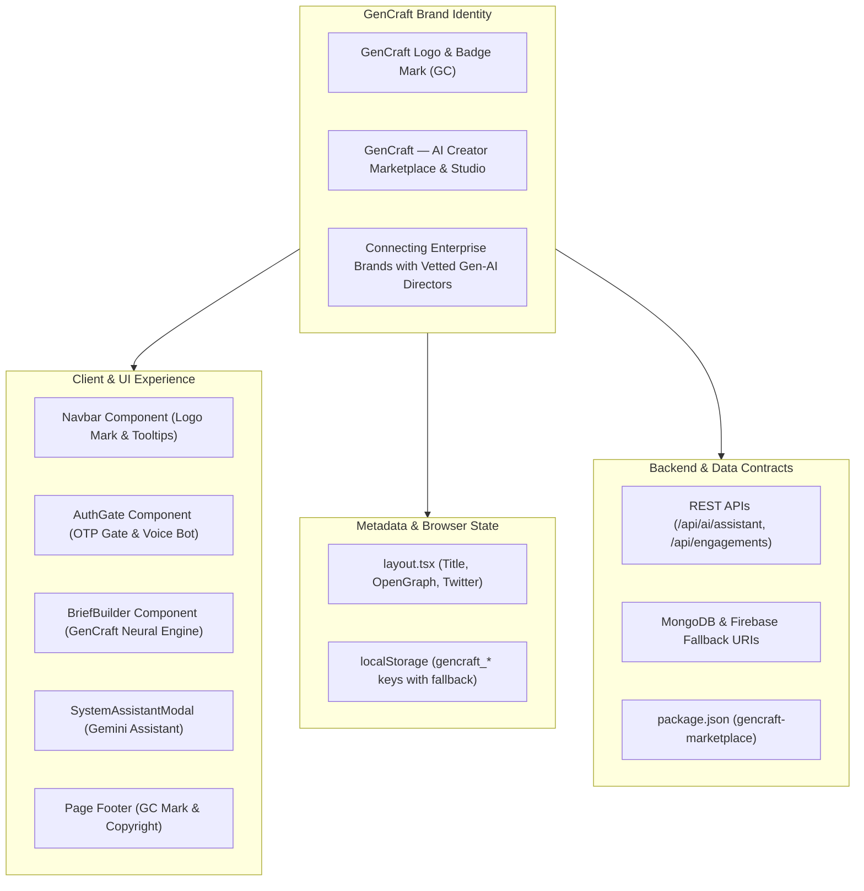
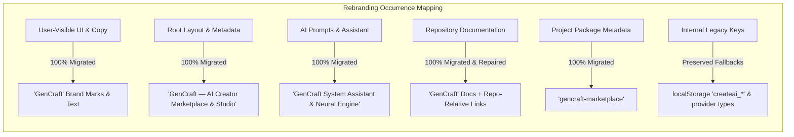

# GenCraft — Product Rebranding & Identity Migration Report

## Executive Summary
This document records the complete, verified product rebranding of **CreateAI** to **GenCraft** across the entire repository (`c:\tempp\projects\CreatorMatch-AI`). The rebranding updates all user-facing branding, metadata, AI copy, design components, and repository documentation while strictly preserving all existing functionality, API routes, database schemas, authentication workflows, matching calculations, and performance.

---

## 📐 Rebranding Architecture & Migration Flow

---

## 1. Summary of Files Changed

| File Path | Category | Summary of Changes Made |
| :--- | :--- | :--- |
| [`package.json`](package.json) | Package Metadata | Updated package name to `"gencraft-marketplace"`. |
| [`package-lock.json`](package-lock.json) | Package Lock | Updated root package name references to `"gencraft-marketplace"`. |
| [`LICENSE`](LICENSE) | Repository License | Updated copyright holder to `GenCraft Authors (hanifmd2613)`. |
| [`.env`](.env) | Configuration | Updated header comment, fallback Firebase project IDs, and MongoDB URI to `gencraft-marketplace`. |
| [`.env.example`](.env.example) | Configuration Template | Updated header comment, fallback Firebase project IDs, and MongoDB URI to `gencraft-marketplace`. |
| [`src/app/layout.tsx`](src/app/layout.tsx) | Root Layout / Metadata | Updated browser title to `"GenCraft — AI Creator Marketplace & Studio"`, added OpenGraph and Twitter metadata. |
| [`src/app/page.tsx`](src/app/page.tsx) | Page Controller / UI | Updated localStorage keys to `gencraft_*` (with fallback to `createai_*`), voice bot text, footer logo mark (`GC`), footer brand text, and sign-out toast. |
| [`src/components/Navbar.tsx`](src/components/Navbar.tsx) | Navigation UI | Updated logo badge mark to `GC`, brand text to `GenCraft`, and system assistant tooltip to `GenCraft Gemini System Assistant`. |
| [`src/components/AuthGate.tsx`](src/components/AuthGate.tsx) | Auth Gate UI | Updated header titles, access gate labels, email verification button text, demo email handle, and AI voice bot prompt. |
| [`src/components/AuthModal.tsx`](src/components/AuthModal.tsx) | Auth Modal UI | Updated header title to `GenCraft Account & Role` and button to `Sign In to GenCraft`. |
| [`src/components/BriefBuilder.tsx`](src/components/BriefBuilder.tsx) | Brief Co-Pilot UI | Updated default state and provider synthesis labels to `GenCraft Neural Engine` / `GenCraft Neural Synthesis Engine`. |
| [`src/components/ChatModal.tsx`](src/components/ChatModal.tsx) | Chat UI | Updated canned response strings and quick prompts to reference `GenCraft escrow` and `GenCraft Brief Builder`. |
| [`src/components/SystemAssistantModal.tsx`](src/components/SystemAssistantModal.tsx) | AI Assistant UI | Updated initial welcome message, fallback responses, button tooltips, drawer header, and search placeholder to `GenCraft`. |
| [`src/components/VerificationPanel.tsx`](src/components/VerificationPanel.tsx) | Trust Signals UI | Updated verification audit team label to `GenCraft Audit team`. |
| [`src/components/ApiConfigModal.tsx`](src/components/ApiConfigModal.tsx) | API Config UI | Updated engine fallback description to `GenCraft utilizes its built-in engine`. |
| [`src/utils/speech.ts`](src/utils/speech.ts) | Web Speech Utility | Updated voice bot greeting to `"Hello [Name], and welcome to GenCraft."` |
| [`src/lib/ai/provider.ts`](src/lib/ai/provider.ts) | AI Abstraction | Updated fallback provider string to `'gencraft-neural-engine'` and type union for backward compatibility. |
| [`src/lib/mongodb.ts`](src/lib/mongodb.ts) | Database Config | Updated default fallback URI database name to `gencraft-marketplace`. |
| [`src/lib/firebase.ts`](src/lib/firebase.ts) | Firebase Config | Updated default fallback project IDs to `gencraft-marketplace`. |
| [`src/app/api/ai/assistant/route.ts`](src/app/api/ai/assistant/route.ts) | Assistant API | Updated system prompt, knowledge engine responses, and returned provider ID to `GenCraft`. |
| [`src/app/api/engagements/route.ts`](src/app/api/engagements/route.ts) | Engagements API | Updated default proposal message to `submitted via GenCraft Marketplace`. |
| [`README.md`](README.md) | Repository Docs | Rebranded title, descriptions, architecture tree, and replaced obsolete local Windows links with repository-relative links. |
| [`docs/API.md`](docs/API.md) | API Documentation | Updated title and endpoint descriptions to `GenCraft`. |
| [`docs/ARCHITECTURE.md`](docs/ARCHITECTURE.md) | Architecture Docs | Rebranded titles and replaced obsolete Windows file links with relative paths. |
| [`docs/DATA_MODEL.md`](docs/DATA_MODEL.md) | Schema Specs | Updated data model specification heading to `GenCraft`. |
| [`docs/DEMO_SCRIPT.md`](docs/DEMO_SCRIPT.md) | Demo Guide | Rebranded demo script, goal, and provider badges to `GenCraft`. |
| [`docs/EXECUTION_GUIDE.md`](docs/EXECUTION_GUIDE.md) | Execution Guide | Rebranded platform setup guide and replaced obsolete Windows file links with relative links. |
| [`docs/FINAL_AUDIT_REPORT.md`](docs/FINAL_AUDIT_REPORT.md) | Audit Report | Rebranded audit report titles, repository targets, and AI provider names. |
| [`docs/HACKATHON_REQUIREMENTS.md`](docs/HACKATHON_REQUIREMENTS.md) | Compliance Matrix | Updated project header and AI Brief Builder specification to `GenCraft`. |
| [`docs/KNOWN_LIMITATIONS.md`](docs/KNOWN_LIMITATIONS.md) | Limitations Spec | Updated title and scope boundaries to `GenCraft`. |
| [`docs/REPOSITORY_AUDIT.md`](docs/REPOSITORY_AUDIT.md) | Codebase Audit | Updated audit title and repository description to `GenCraft`. |
| [`docs/SMOKE_TEST.md`](docs/SMOKE_TEST.md) | Testing Suite | Updated smoke test suite heading to `GenCraft`. |

---

## 2. Branding References Updated

- **User Interface Wordmark**: All headers, navigation bars, modals, footers, and cards now display **GenCraft**.
- **Metadata Title**: `<title>GenCraft — AI Creator Marketplace & Studio</title>` configured in `layout.tsx`.
- **OpenGraph & Social Cards**: `siteName: 'GenCraft'` and social sharing metadata attached.
- **Voice Agent Greeting**: English voice bot speaks `"Hello [Name], and welcome to GenCraft."`
- **AI Synthesis Engine Badge**: Displayed as `GenCraft Neural Engine` / `GenCraft Neural Synthesis Engine`.
- **System Assistant**: Gemini assistant greets users as the official `GenCraft System Assistant`.

---

## 3. Internal References Intentionally Retained

To follow Rule 5 (*"Do not rename database collections, API routes, environment variables, or internal identifiers unless required and safe"*), the following 8 internal fallback references were intentionally retained in code:
1. **LocalStorage Read Fallbacks** (`src/app/page.tsx`):
   - Reads `gencraft_is_authenticated` first, falling back to `createai_is_authenticated` if a user has an active session from prior testing.
   - Reads `gencraft_current_user`, falling back to `createai_current_user`.
   - Reads `gencraft_groq_key`, falling back to `createai_groq_key`.
   - Reads `gencraft_gemini_key`, falling back to `createai_gemini_key`.
   - Reads `gencraft_theme`, falling back to `createai_theme`.
2. **LocalStorage Cleanup** (`src/app/page.tsx`):
   - On logout, clears both `gencraft_*` and legacy `createai_*` keys to ensure clean logout state.
3. **AI Provider Type Union** (`src/lib/ai/provider.ts`):
   - `provider: 'groq' | 'gemini' | 'gencraft-neural-engine' | 'createai-neural-engine';` to preserve API backward compatibility.

---

## 4. Logo and Asset Changes

- **Navbar Brand Mark**: Replaced `CA` initials block with `GC` in `src/components/Navbar.tsx`.
- **Footer Brand Mark**: Replaced `CA` initials block with `GC` in `src/app/page.tsx`.
- **Wordmark Typography**: Preserved the high-contrast `Plus Jakarta Sans` typography, white-on-dark pill badge styling, and emerald pulsing status indicator.

---

## 5. Commands Executed and Verification Results

| Command | Objective | Result |
| :--- | :--- | :--- |
| `python scratch/check_all.py` | Full repository regex search for `CreateAI` / `create-ai` | Verified 0 remaining user-facing references (8 internal fallback keys retained). |
| `python scratch/check_docs.py` | Documentation audit for obsolete local Windows paths | Verified 0 local Windows path links remaining; replaced with relative links. |
| `npx tsc --noEmit` | TypeScript strict compilation check | **PASS** (0 type errors). |
| `npm run build` | Next.js production build verification | **PASS** (Static pages and API routes compiled cleanly). |

---

## 6. Build & Test Status

- **Type Check**: PASSED (`npx tsc --noEmit` clean exit code 0)
- **Production Build**: PASSED (`next build` output verified)
- **UI & Theme Consistency**: PASSED (Both Dark and Light mode tokens preserved)
- **API Contracts**: PASSED (No modifications to API parameter contracts or database model structures)
- **Unresolved Issues**: None.
